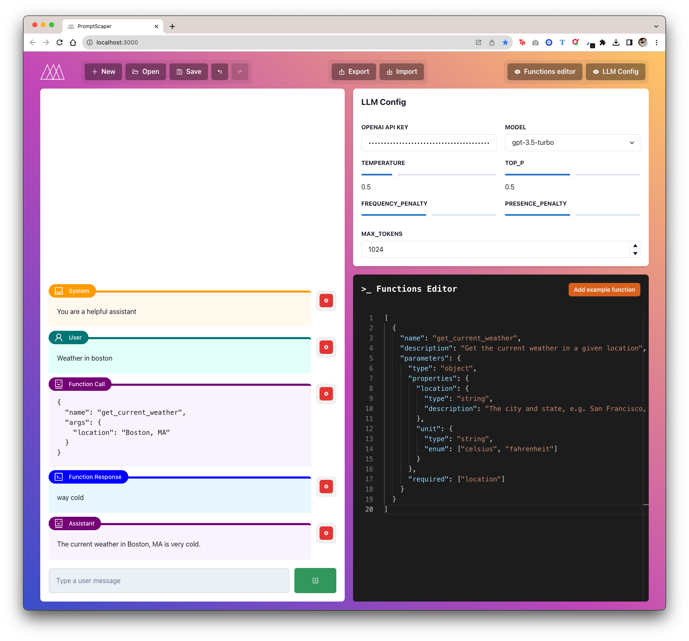

#   PromptScaper

A client-only OpenAI LLM Playground for building agents without writing any code.

You can save (in IndexedDB) and reopen workspaces later or export and share with a coworker.

The goal of this project is to enable you to explore how function calling can improve your agents _before_ investing in actually deciding what those functions need to do. You just type in the function response as text.

  

## Run the live version

[promptscaper.com](https://www.promptscaper.com/)

## Running Locally

```bash
npm i
```

Run the development server:

```bash
npm run dev
# or
yarn dev
# or
pnpm dev
```

Open [http://localhost:3000](http://localhost:3000) with your browser to see the result.
